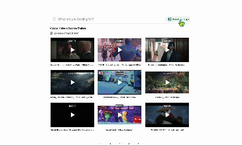
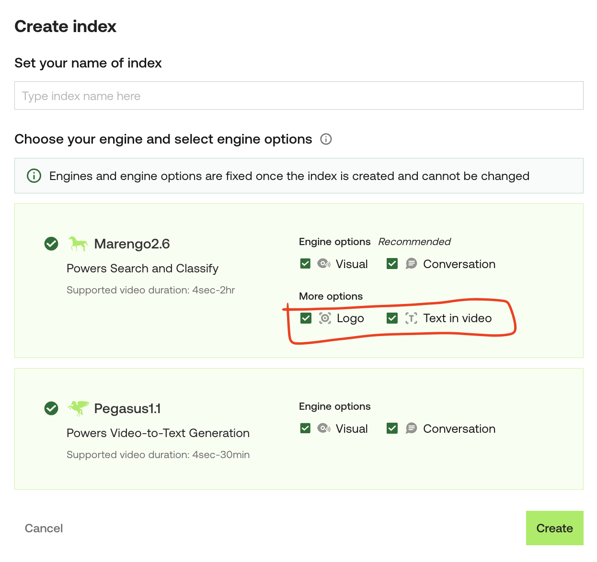

## 👋 Introduction

Crop and Seek demonstrates the power of advanced video search capabilities using the Twelve Labs API. By implementing both text and image-based search, along with the unique image cropping feature, this application provides a flexible and powerful tool for discovering relevant video content.

⭐️ Check out the [Demo](https://crop-seek.vercel.app/)!

<div align="center">
  <a href="https://crop-seek.vercel.app/">
    
  </a>
</div>

### Built With

- Next.js
- React
- Tailwind CSS
- Twelve Labs API

## 📷 Image Prerequisites

The images you wish to use must meet the following requirements:

- Format: JPEG and PNG. (\* Public image URLs should end with .jpg, .jpeg, or .png)
- Dimension: Must be larger than 378x378 pixels.
- Size: Must not exceed 5MB.
- Object visibility: Ensure that the objects of interest are visible and occupy at least 50% of the video frame. This helps the platform accurately identify and match the objects.

## 🔑 Getting Started

### Step 1. Generate Twelve Labs API key

Visit [Twelve Labs Playground](https://playground.twelvelabs.io/) to generate your API Key

- Upon signing up, you'll receive free credits to index up to 10 hours of video content!

### Step 2. Create an index if you don't have one

- Check [here](https://docs.twelvelabs.io/docs/create-indexes) on how to create an index and get the index id
- Make sure you check “Logo” and “Text in Video” under “More options”
  

### Step 3. (Option 1) Start the App on Replit

1. Click the button below and import the repl

   [](https://replit.com/new/github/mrnkim/crop-seek)

2. Update Secrets (equivalent to .env file)

```
TWELVELABS_API_KEY=<YOUR API KEY>
TWELVELABS_INDEX_ID=<YOUR INDEX ID>
```

3. Stop and run the Repl

### Step 3. (Option 2) Start the App Locally

1. Clone the current repo

```sh
git clone git@github.com:mrnkim/crop-seek.git
```

2. Create `.env` file in the root directory and provide the values for each key

```
 TWELVELABS_API_KEY=<YOUR API KEY>
 TWELVELABS_INDEX_ID=<YOUR INDEX ID>
```

3. Install and start the client

```
npm install
npm run dev
```

4. Open [http://localhost:3000](http://localhost:3000) with your browser to see the result.
